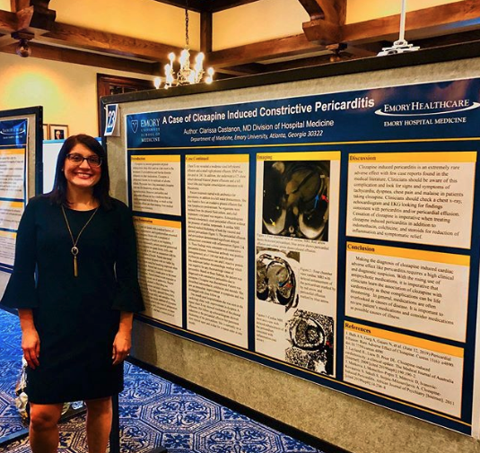

# A Case of Clozapine Induced Constrictive Pericarditis

**Author: Clarissa Castanon, MD Division of Hospital Medicine**

## Case Presentation

A 72 year old female with a medical history of anxiety, hypertension, and hypothyroidism presented to the Emergency Room with a complaint of persistent shortness of breath at rest beginning 3 days prior. Additionally, Patient reported generalized myalgias, repeated low-grade fevers, chills, and reflux-like pain in her chest in conjunction with the onset of shortness of breath. Patient also noted paroxysmal nocturnal dyspnea with no visible leg swelling. Patient noted her breathing improved when leaning forward. Patient had recently traveled to Croatia, Greece and Italy 2 weeks prior to the onset of her symptoms. Patient denied recent exposure to sick contacts or recent use of antibiotics. Patient denied tobacco, alcohol or illicit drug use.

Patients medications included: clozapine 50mg daily, amlodipine 5mg daily, atenolol 50mg daily, levothyroxine 125mcgs daily, and sertraline 50mg daily. Patient noted the recent addition of Clozapine beginning 2 months prior to the time of presentation.

Chest X-ray showed a moderate sized left pleural effusion and a small right pleural effusion. Patient was also leukopenic at 3.8K white blood cells and febrile to 38.3 ℃.

Patient treatment started with antibiotics for pneumonia, in addition to a left sided thoracentesis. She was found to have an exudative pleural effusion that was lymphocyte-predominant. No organisms were isolated from the pleural fluid culture, and a full respiratory viral panel was negative. Echocardiogram showed a moderately sized pericardial effusion without the presence of cardiac tamponade. A cardiac MRI showed marked thickening of both the visceral and parietal pericardium. The pericardial effusion and pericardium demonstrated significant delayed enhancement consistent with inflammation. These findings were consistent with constrictive pericardial disease. Antinuclear antibody was positive homogeneously at a 1:160 titer with elevated erythrocyte sedimentation rate and C-reactive protein. She underwent further rheumatologic workup which was negative for any rheumatologic cause of pericarditis. Based on these findings, the patient was diagnosed with constrictive pericarditis due to clozapine. Clozapine was discontinued. Patient was prescribed indomethacin, colchicine and Steroids. She saw an immediate improvement in symptoms and was discharged with close follow up.

One month post hospitalization she was seen in the cardiology clinic with improvement in dyspnea. A repeat chest X-ray showed resolution of the pleural effusions. Her follow up echocardiogram showed reduction in the pericardial effusion but persistent thickening of the pericardium. She is currently on a slow steroid taper and is due for a repeat echo in one month.

## Discussion

Clozapine induced pericarditis is an extremely rare adverse effect with few case reports found in the medical literature. Clinicians should look for signs and symptoms of tachycardia, dyspnea, chest pain and malaise in patients taking clozapine. Cessation of clozapine is imperative when treating clozapine induced pericarditis in addition to indomethacin, colchicine, and steroids.

## Conclusion

Making the diagnosis of clozapine induced cardiac adverse effects like pericarditis requires a high degree of clinical suspicion. Medications are often overlooked as causes of disease, and as a result it is of tantamount importance to review a patient’s list of medications in conjunction with their symptoms when preparing a diagnosis.

*Author Disclosures: None*

